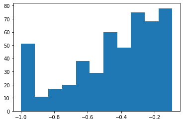
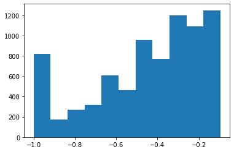
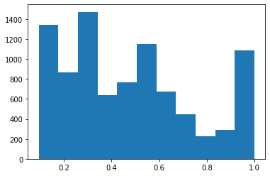
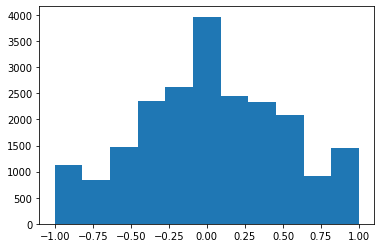

## Self-driving car nanodegree program project No. 4 --- Behavior Cloning

The aim of this project is to design and build a CNN architecture to train the controller of the vehicle out of captured data and images from a car drive simulation. The CNN is trained from augumented data which is obtained by augmenting the original data by copying non-zero degree steerings.The model architecture can be seen from the file 'model.py' and the explanation of data augmentation can be found below. For the data collection, one clockwise lap and one counter clockwise driving are recorded to make the data more general.

### library importing

Useful libraries are imported


```python
import tensorflow as tf
import numpy as np
import pandas as pd
import random
import os
import cv2
import csv
import matplotlib.pyplot as plt
from sklearn.utils import shuffle
import matplotlib.image as mpimg
from sklearn.model_selection import train_test_split
from tensorflow.python.keras.models import Sequential, Model
from tensorflow.python.keras.layers import Dense, Dropout, Activation, Flatten, Input,  Lambda
from tensorflow.python.keras.layers import Conv2D

print('Done with importing')


```

    Done with importing
    

In the following code, the data are read from driving_log.csv file and the angle of the driving log file was fed to the array as y_train; images are red and fed to the array as X_train. From the histogram below we can see that the 'zero' angles almost dominate the whole y_train array. In order to make the left and right turns can be "seen" by the model, the X_train and y_train will be augmented.


```python
lines = []
with open('./Desktop/img/driving_log.csv') as csvfile:
    reader = csv.reader(csvfile)
    for line in reader:
        lines.append(line)


        
images = []
for lin in lines:
    source_path = line[0]
    filename = source_path.split('/')[-1]
    current_path = './Desktop/img/test/'+filename
    image = mpimg.imread(current_path)
    images.append(image)
headers = ['center', 'left', 'right', 'angle', 'throttle', 'brake', 'speed' ]
data = pd.read_csv('./Desktop/img/driving_log.csv',names=headers)
data = np.array(data)

X_train = np.array(images)
y_train = data[:,3]
hist = plt.hist(y_train,bins = 11)
```


We first count the number of bars shown in the histgram and count the number at each bar.


```python
[count, ang_range] = np.histogram(y_train,bins = 11)
```

From the counting, we split the left turn angles and right turn angles and make them separate arrays.


```python
X_high = []
y_high = []
X_low  = []
y_low = []
ang_low = -0.09090909090909083
ang_high = 0.09090909090909083
for idx in range(len(y_train)):
    if ((y_train[idx]>ang_high)):
        X_high.append(X_train[idx])
        y_high.append(y_train[idx])

        
for idx in range(len(y_train)):
    if ((y_train[idx]<ang_low)):
        X_low.append(X_train[idx])
        y_low.append(y_train[idx])

X_high = np.array(X_high)
y_high = np.array(y_high)
X_low = np.array(X_low)
y_low = np.array(y_low)
```

The histgram of left turning angles and right turning angles are plotted and we can see that the number of right turning angles are less than the left turning ones which means more right turning angles shall be augmented for compensation.


```python
hist = plt.hist(y_high,bins = 11)
```


```python
hist = plt.hist(y_low,bins = 11)
```





The generate_img function generates augmented images and corresponding angles by copying the original ones. To balance the difference in left and right angles, the right angles are augmented for one more iteration.


```python
# data augmentation
def generate_img(img,ang,num):
    for i in range(num):
        img = np.concatenate((img,img),axis=0)
        ang = np.concatenate((ang,ang),axis=0)
    return img, ang


it_low = 4
it_high = 5
X_lownew, y_lownew = generate_img(X_low,y_low,it_low)
X_highnew, y_highnew = generate_img(X_high,y_high,it_high)
```

The augmented left and right turning angles can be seen from the below histgrams.


```python
hist = plt.hist(y_lownew,bins = 11)
```





```python
hist = plt.hist(y_highnew,bins = 11)
```





Then the augmented data are fed to the original one to form the augmented dataset, which is our traning set.


```python
X_tabnew = np.concatenate((X_lownew,X_highnew),axis=0)
y_tabnew = np.concatenate((y_lownew,y_highnew),axis=0)
```


```python
X_aug = np.concatenate((X_train,X_tabnew),axis=0)
y_aug = np.concatenate((y_train,y_tabnew),axis=0)
hist = plt.hist(y_aug,bins = 11)
```





The model is architected as below with one lambda layer, five convolutional layers, one flatten layer and five densely-connected NN layers.


```python
# split training, validation and testing sets
X_aug,y_aug = shuffle(X_aug,y_aug)
X_train, X_valid, y_train, y_valid = train_test_split(X_aug,y_aug,random_state=0, test_size=0.2)

model = Sequential()
model.add(Lambda(lambda x: x/255.0 - 0.5, input_shape=(160,320,3)))                              
model.add(Conv2D(32,(5,5),activation = "relu", strides=(2,2)))
model.add(Conv2D(64,(5,5),activation = "relu", strides=(2,2)))
model.add(Conv2D(128,(5,5),activation = "relu", strides=(2,2)))
model.add(Conv2D(64,(3,3),activation = "relu"))
model.add(Conv2D(32,(3,3))) 
model.add(Activation('relu'))
model.add(Flatten())
model.add(Dropout(0.5))
model.add(Activation('relu'))
model.add(Dense(100))
model.add(Dense(50))
model.add(Dense(10)) 
model.add(Dense(1))  
print(model.summary())
#model.compile(loss = 'mse',optimizer='adam')
#model.fit(X_train,y_train,epochs=5,validation_data=(X_valid,y_valid))
model.save('model.h5')
print('model saved')
```

    _________________________________________________________________
    Layer (type)                 Output Shape              Param #   
    =================================================================
    lambda_5 (Lambda)            (None, 160, 320, 3)       0         
    _________________________________________________________________
    conv2d_297 (Conv2D)          (None, 78, 158, 32)       2432      
    _________________________________________________________________
    conv2d_298 (Conv2D)          (None, 37, 77, 64)        51264     
    _________________________________________________________________
    conv2d_299 (Conv2D)          (None, 17, 37, 128)       204928    
    _________________________________________________________________
    conv2d_300 (Conv2D)          (None, 15, 35, 64)        73792     
    _________________________________________________________________
    conv2d_301 (Conv2D)          (None, 13, 33, 32)        18464     
    _________________________________________________________________
    activation_288 (Activation)  (None, 13, 33, 32)        0         
    _________________________________________________________________
    flatten_6 (Flatten)          (None, 13728)             0         
    _________________________________________________________________
    dropout_3 (Dropout)          (None, 13728)             0         
    _________________________________________________________________
    activation_289 (Activation)  (None, 13728)             0         
    _________________________________________________________________
    dense_17 (Dense)             (None, 100)               1372900   
    _________________________________________________________________
    dense_18 (Dense)             (None, 50)                5050      
    _________________________________________________________________
    dense_19 (Dense)             (None, 10)                510       
    _________________________________________________________________
    dense_20 (Dense)             (None, 1)                 11        
    =================================================================
    Total params: 1,729,351
    Trainable params: 1,729,351
    Non-trainable params: 0
    _________________________________________________________________
    None
    model saved
    

The model was trained in the GPU mode of the workspace and the trained model was saved to 'model.h5'. By running the model in autonomous mode, the results were okay.
