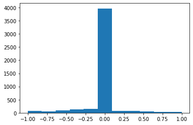
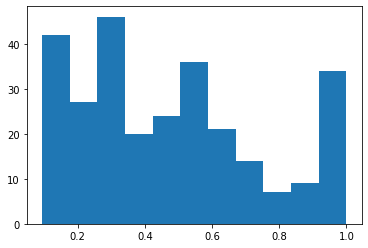
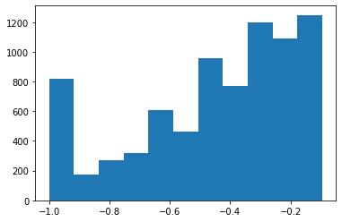
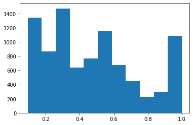
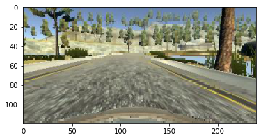
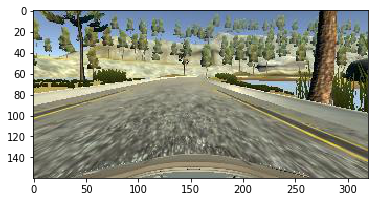

```python
import tensorflow as tf
import numpy as np
import pandas as pd
import random
import os
import cv2
import csv
import matplotlib.pyplot as plt
from sklearn.utils import shuffle
import matplotlib.image as mpimg

from tensorflow.python.keras.models import Sequential, Model
from tensorflow.python.keras.layers import Dense, Dropout, Activation, Flatten, BatchNormalization, merge, Input, BatchNormalization, Lambda
from tensorflow.python.keras.layers import Convolution2D, MaxPooling2D, ZeroPadding2D, AveragePooling2D, GlobalAveragePooling2D

print('Done with importing')


```

    Done with importing
    


```python
lines = []
with open('./Desktop/img/driving_log.csv') as csvfile:
    reader = csv.reader(csvfile)
    for line in reader:
        lines.append(line)


        
images = []
for lin in lines:
    source_path = line[0]
    filename = source_path.split('/')[-1]
    current_path = './Desktop/img/test/'+filename
    image = mpimg.imread(current_path)
    images.append(image)
headers = ['center', 'left', 'right', 'angle', 'throttle', 'brake', 'speed' ]
data = pd.read_csv('./Desktop/img/driving_log.csv',names=headers)
data = np.array(data)

X_train = np.array(images)
y_train = data[:,3]
hist = plt.hist(y_train,bins = 11)
print(y_train.shape)
```

    (4744,)
    





```python
[count, ang_range] = np.histogram(y_train,bins = 11)
print(count)
print(ang_range)
n_classes = len(count)
print(n_classes)
```

    [  66   49   87  139  154 3969   74   71   63   28   44]
    [-1.0 -0.8181818181818181 -0.6363636363636364 -0.4545454545454546
     -0.2727272727272727 -0.09090909090909083 0.09090909090909083
     0.2727272727272727 0.4545454545454546 0.6363636363636365
     0.8181818181818183 1.0]
    11
    


```python
X_high = []
y_high = []
X_low  = []
y_low = []
ang_low = -0.09090909090909083
ang_high = 0.09090909090909083
for idx in range(len(y_train)):
    if ((y_train[idx]>ang_high)):
        X_high.append(X_train[idx])
        y_high.append(y_train[idx])

        
for idx in range(len(y_train)):
    if ((y_train[idx]<ang_low)):
        X_low.append(X_train[idx])
        y_low.append(y_train[idx])

X_high = np.array(X_high)
y_high = np.array(y_high)
X_low = np.array(X_low)
y_low = np.array(y_low)
```


```python
hist = plt.hist(y_high,bins = 11)
```





```python
hist = plt.hist(y_low,bins = 11)
```


```python
X_tab = np.concatenate((X_low,X_high),axis=0)
y_tab = np.concatenate((y_low,y_high),axis=0)
```


```python
# data augmentation
def generate_img(img,ang,num):
    for i in range(num):
        img = np.concatenate((img,img),axis=0)
        ang = np.concatenate((ang,ang),axis=0)
        print(ang.shape)
    return img, ang


it_low = 4
it_high = 5
X_lownew, y_lownew = generate_img(X_low,y_low,it_low)
X_highnew, y_highnew = generate_img(X_high,y_high,it_high)
# X_aug = np.array(np.zeros((1, 160,320,3)))
# y_aug = np.array([0])
# for idx in range(len(y_tab)):
#     print(idx)
#     aug_img, aug_ang = aug_image(X_tab[idx],y_tab[idx],it)
#     aug_img = np.array(aug_img)
#     aug_ang = np.array(aug_ang)
#     print(X_tab[idx].shape)
#     print(aug_img.shape)
#     image = np.concatenate((X_tab[idx],aug_img),axis=0)
#     angle = np.concatenate((y_tab[idx],aug_ang),axis=0)
# X_aug = np.concatenate((X_tab,image),axis=0)
# y_aug = np.concatenate((y_tab,angle),axis=0)
```

    (990,)
    (1980,)
    (3960,)
    (7920,)
    (560,)
    (1120,)
    (2240,)
    (4480,)
    (8960,)
    


```python
hist = plt.hist(y_lownew,bins = 11)
```





```python
hist = plt.hist(y_highnew,bins = 11)
```





```python
X_tabnew = np.concatenate((X_lownew,X_highnew),axis=0)
y_tabnew = np.concatenate((y_lownew,y_highnew),axis=0)
```


```python
X_aug = np.concatenate((X_train,X_tabnew),axis=0)
y_aug = np.concatenate((y_train,y_tabnew),axis=0)
hist = plt.hist(y_aug,bins = 11)
```


```python
y_aug.shape
```


    (21624,)


```python
img = []
for i in range(X_train.shape[0]):
    img.append(cv2.resize(X_train[i],(240,120),interpolation = cv2.INTER_AREA))
img = np.array(img)
print(img.shape)
```

    (4744, 120, 240, 3)
    


```python
plt.imshow(img[1000])
```


    <matplotlib.image.AxesImage at 0x18b570c88d0>





```python
plt.imshow(X_train[1000])
```


    <matplotlib.image.AxesImage at 0x18b56c671d0>





```python
model = Sequential()
model.add(Lambda(lambda x: x/255.0 -0.5, input_shape = (160,320,3)))
model.add(Flatten())
model.add(Dense(1))

model.compile(loss = 'mse',optimizer='adam')
model.fit(X_train,y_train,validation_split=0.2,shuffle = True,epochs=7)

model.save('model.h5')
```

    Train on 3795 samples, validate on 949 samples
    Epoch 1/7
    3795/3795 [==============================] - 8s 2ms/step - loss: 15.9976 - val_loss: 0.0639
    Epoch 2/7
    3795/3795 [==============================] - 6s 2ms/step - loss: 0.0454 - val_loss: 0.0683
    Epoch 3/7
    3795/3795 [==============================] - 6s 2ms/step - loss: 0.0488 - val_loss: 0.0683
    Epoch 4/7
    3795/3795 [==============================] - 6s 2ms/step - loss: 0.0484 - val_loss: 0.0637
    Epoch 5/7
    3795/3795 [==============================] - 6s 1ms/step - loss: 0.0494 - val_loss: 0.0785
    Epoch 6/7
    3795/3795 [==============================] - 6s 2ms/step - loss: 0.0545 - val_loss: 0.0765
    Epoch 7/7
    3795/3795 [==============================] - 7s 2ms/step - loss: 0.0593 - val_loss: 0.0636
    


```python

```


```python

```
